<div align="center">

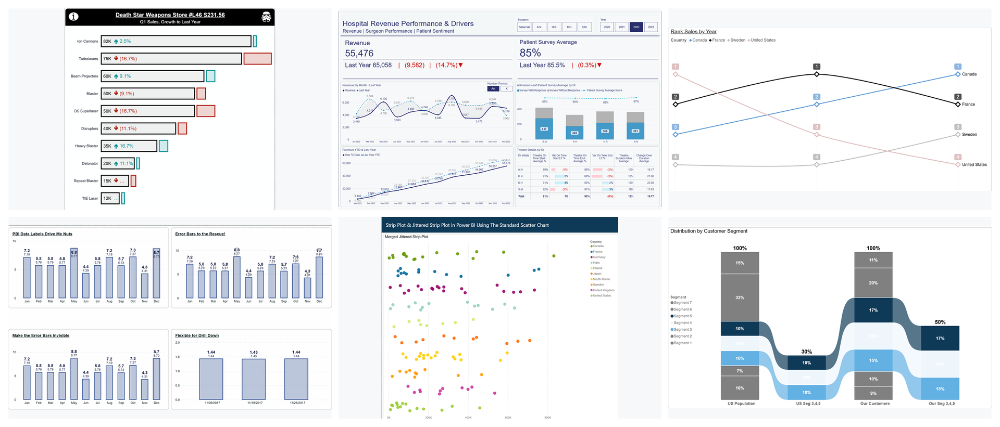

# Power BI Files

### The `.pbix` files behind my Power BI tips on LinkedIn

Seventeen working reports. Every one has the data baked in, so you can open it, click into any visual, and see exactly how the trick is wired up.

<br>

[](#the-files) [](#the-files) [](https://www.linkedin.com/in/osborntim/) [](https://github.com/InsightfulAnalytics/PBI-Files/stargazers)

</div>

---

Most of these started as a LinkedIn post: someone asks whether Power BI can do a thing, the answer turns out to be yes, and the file is the proof. Almost all of it is built with the **core visuals**. No custom visual to install, no Deneb, no R or Python. Just formatting cards, measures, visual calculations and the occasional piece of misuse that the product never advertised.

If one of these saves you an afternoon, a star costs you nothing and helps other people find it.

<br>

## Gallery

<table>
<tr>
<td width="33%" align="center"><a href="#error-bars-for-column-chart-data-labels">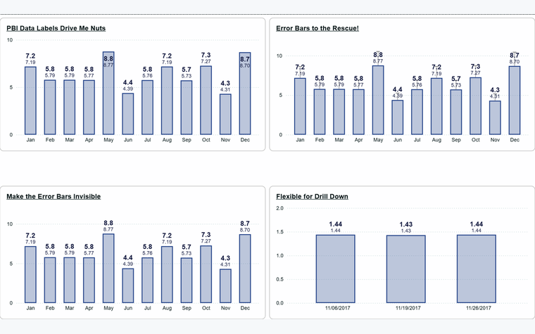<br><b>Error bars as label headroom</b></a></td>
<td width="33%" align="center"><a href="#data-labels-above-the-x-axis">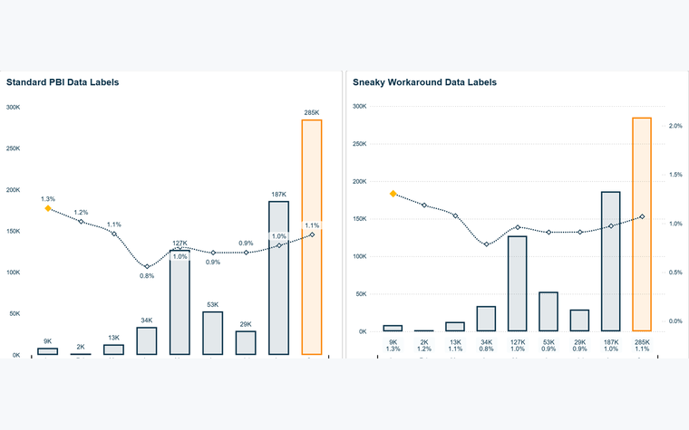<br><b>Data labels above the x axis</b></a></td>
<td width="33%" align="center"><a href="#dynamic-format-strings">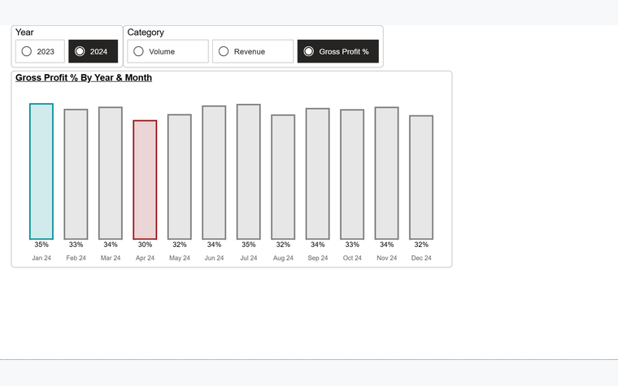<br><b>Dynamic format strings</b></a></td>
</tr>
<tr>
<td align="center"><a href="#visual-calculations-for-y-axis-max">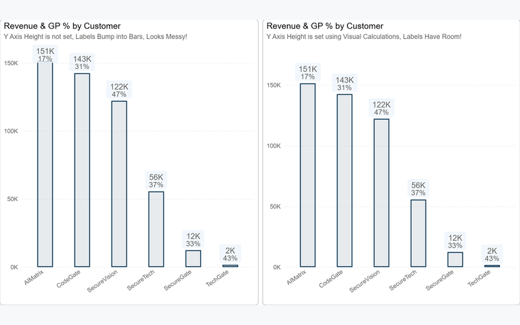<br><b>Visual calcs set the axis max</b></a></td>
<td align="center"><a href="#slope-chart">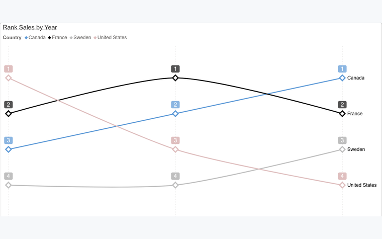<br><b>Slope chart from a line chart</b></a></td>
<td align="center"><a href="#strip-plot">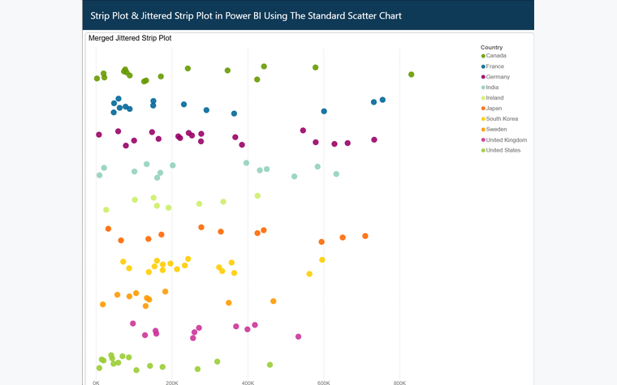<br><b>Strip and jittered strip plots</b></a></td>
</tr>
<tr>
<td align="center"><a href="#3-service-profit-analysis">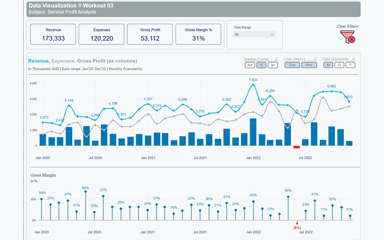<br><b>Lollipop chart, no lollipop visual</b></a></td>
<td align="center"><a href="#distribution-by-customer-segment">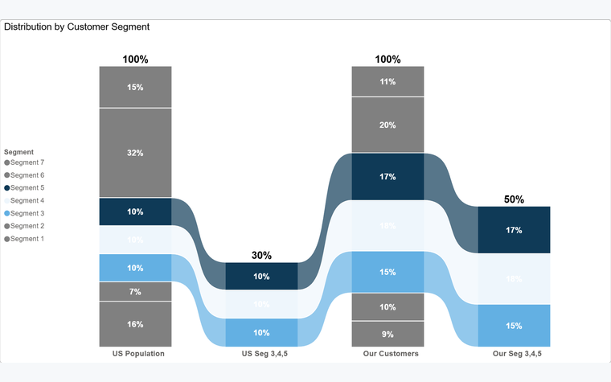<br><b>Ribbons on a stacked column</b></a></td>
<td align="center"><a href="#testing-ribbon-chart">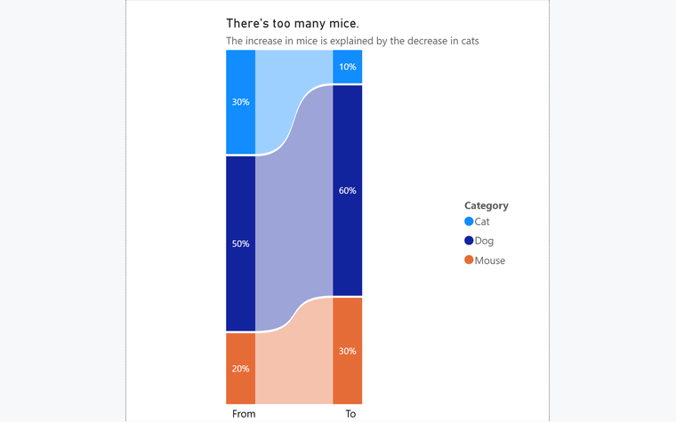<br><b>Ribbons on 100% stacked</b></a></td>
</tr>
<tr>
<td align="center"><a href="#transparent-chart-switching">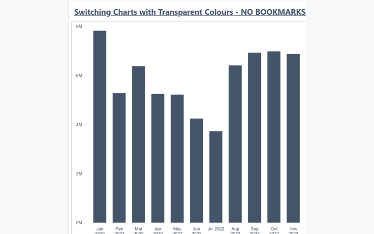<br><b>Chart switching, no bookmarks</b></a></td>
<td align="center"><a href="#transparent-text">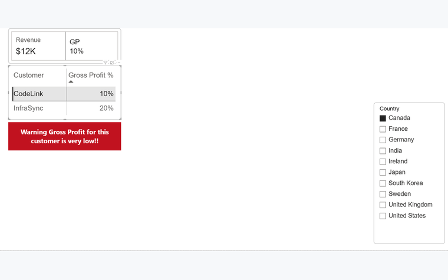<br><b>A banner that hides itself</b></a></td>
<td align="center"><a href="#variance-highlights-stacked-bar-chart">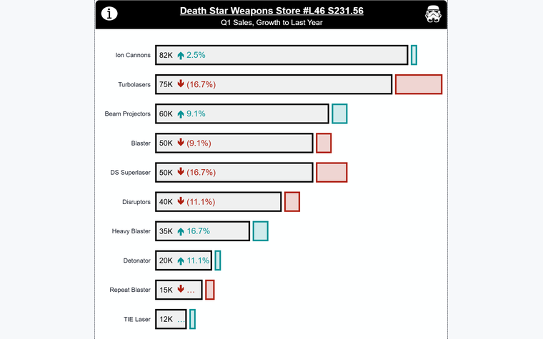<br><b>Variance as the tip of a bar</b></a></td>
</tr>
<tr>
<td align="center"><a href="#8-line-chart-with-selection-highlight">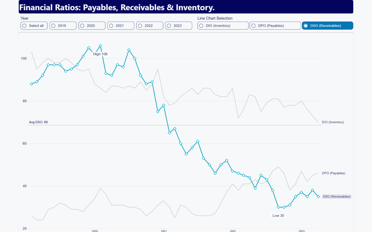<br><b>Highlight one line in a crowd</b></a></td>
<td align="center"><a href="#y-axis-ratio">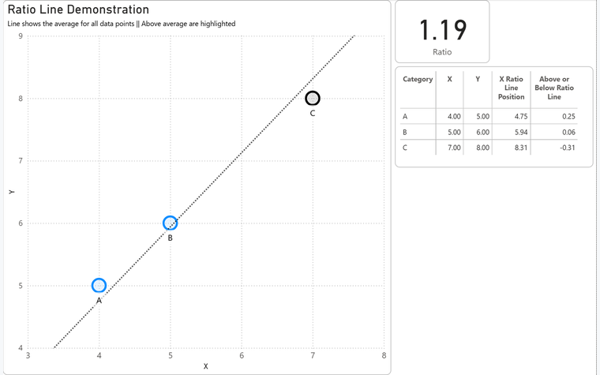<br><b>Scatter chart ratio line</b></a></td>
<td align="center"><a href="#health-dataset">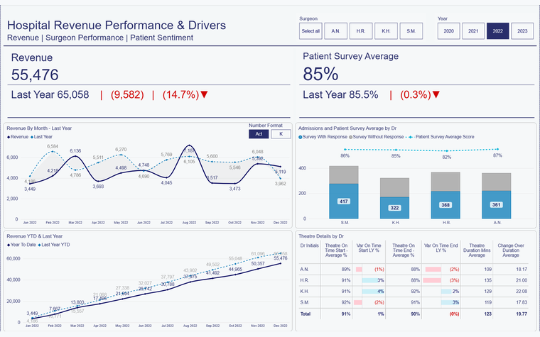<br><b>A faked variance band</b></a></td>
</tr>
<tr>
<td align="center"><a href="#half-blank-lines-pl">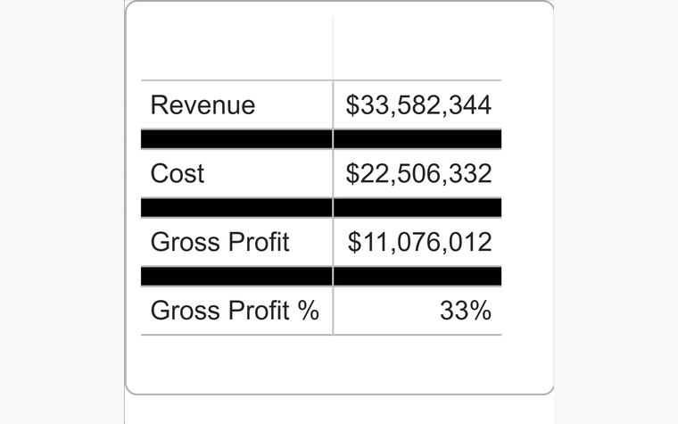<br><b>Half height rows in a matrix</b></a></td>
<td align="center"><a href="#sales--budget">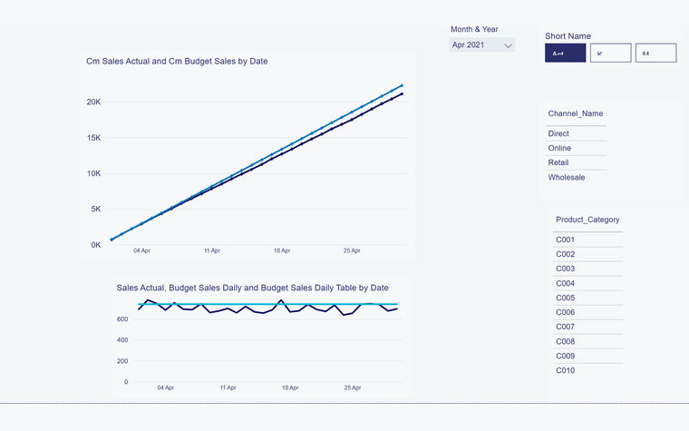<br><b>Monthly budget, daily grain</b></a></td>
<td></td>
</tr>
</table>

<br>

## Getting started

1. Download the `.pbix` you want, or clone the whole repo.
2. Open it in [Power BI Desktop](https://powerbi.microsoft.com/desktop/).
3. Click the visual you came for and open the **Format** pane. The trick is always in a formatting card or a measure, and this README tells you which one.

There is nothing to connect and nothing to refresh. Every file carries its own model with the data already loaded, so they open offline and behave exactly as they did when the post went out.

One dependency worth knowing about: **3 Service Profit Analysis** uses the ChicletSlicer visual for three of its parameter controls. It is bundled inside the file, but if your tenant blocks organisational visuals those three slicers will not render. Every other file uses core visuals only.

<br>

## The files

- [Data labels that behave](#data-labels-that-behave)
- [Chart types the core visuals were never meant to make](#chart-types-the-core-visuals-were-never-meant-to-make)
- [Transparency as a formatting tool](#transparency-as-a-formatting-tool)
- [Variance, highlighting and context](#variance-highlighting-and-context)
- [Matrix layout and DAX plumbing](#matrix-layout-and-dax-plumbing)

<br>

## Data labels that behave

### Error bars for column chart data labels

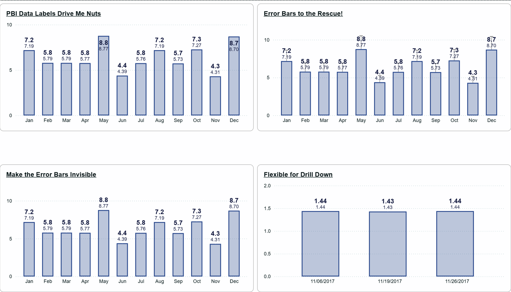

Column chart data labels sit outside the column when there is room and flip inside when there is not, so a field parameter switch or a drill down can wreck them. Driving the axis maximum from a measure fixes the first problem but not the second: drill into a month and the axis stays where it was, so the daily columns shrink to nothing.

Error bars fix both. One measure:

```
Error Bars = [Y Axis] * 1.2
```

Put it in the error bar's **upper bound**, turn the bar on, colour it the same as the chart background, and switch the markers and tooltips off. The chart now sizes its own axis to 1.2 times whatever is currently on screen, drill downs included, and the thing doing it is invisible.

The four tiles are the argument in order: the problem, the error bar switched on so you can see it, the error bar hidden, and a drilled version proving the axis follows.

> Between tiles two and three, the only things that change are the marker switch and the bar colour.

[Read the post](https://www.linkedin.com/feed/update/urn:li:activity:7394984274246000642) &nbsp;·&nbsp; [Download](https://github.com/InsightfulAnalytics/PBI-Files/raw/main/Error%20bars%20for%20column%20chart%20data%20labels.pbix) &nbsp;·&nbsp; 1 page, 4 visuals

<br>

### Data labels above the x axis

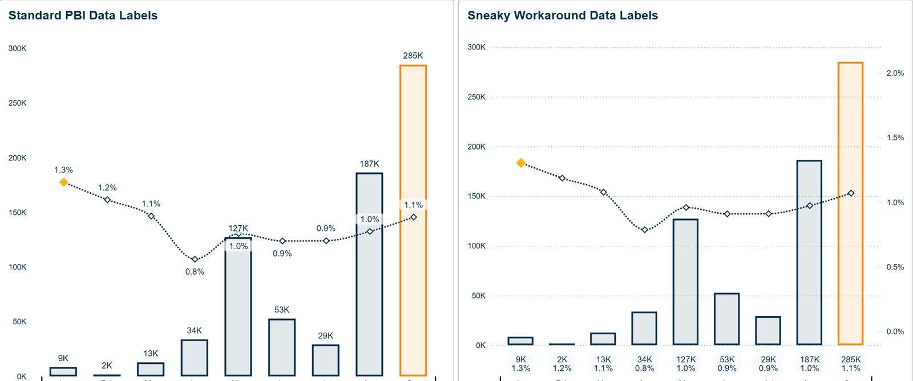

Instead of sitting on top of each column, every label lines up in a single row just above the axis. A visual calculation returning a negative number is bound to the axis **Start**, which opens a band below zero. An invisible line series is plotted in that band, and its multi line label is re-pointed at the real measures with `dynamicLabelValue` and `dynamicLabelDetail`.

Left chart is the control, right chart is the technique, same data.

[Read the post](https://www.linkedin.com/feed/update/urn:li:activity:7381908321672318976) &nbsp;·&nbsp; [Download](https://github.com/InsightfulAnalytics/PBI-Files/raw/main/Data%20Labels%20Above%20X%20Axis.pbix) &nbsp;·&nbsp; 1 page, 3 visuals

<br>

### Dynamic format strings

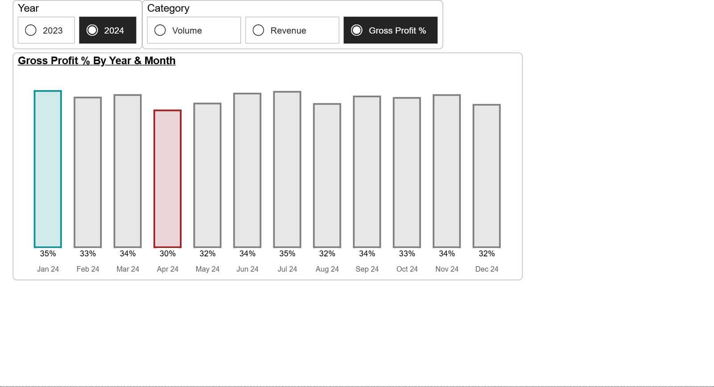

One measure switched by a button slicer over a disconnected table, carrying a dynamic format string so Volume, Revenue and Gross Profit % each get their own number format. The catch is that parked labels normally lose the format. Setting **display units to None** on the label is what keeps the measure's own format alive.

[Read the post](https://www.linkedin.com/feed/update/urn:li:activity:7391370848294719488) &nbsp;·&nbsp; [Download](https://github.com/InsightfulAnalytics/PBI-Files/raw/main/Dynamic%20format%20strings.pbix) &nbsp;·&nbsp; 2 pages, 4 visuals

<br>

### Visual calculations for Y axis max

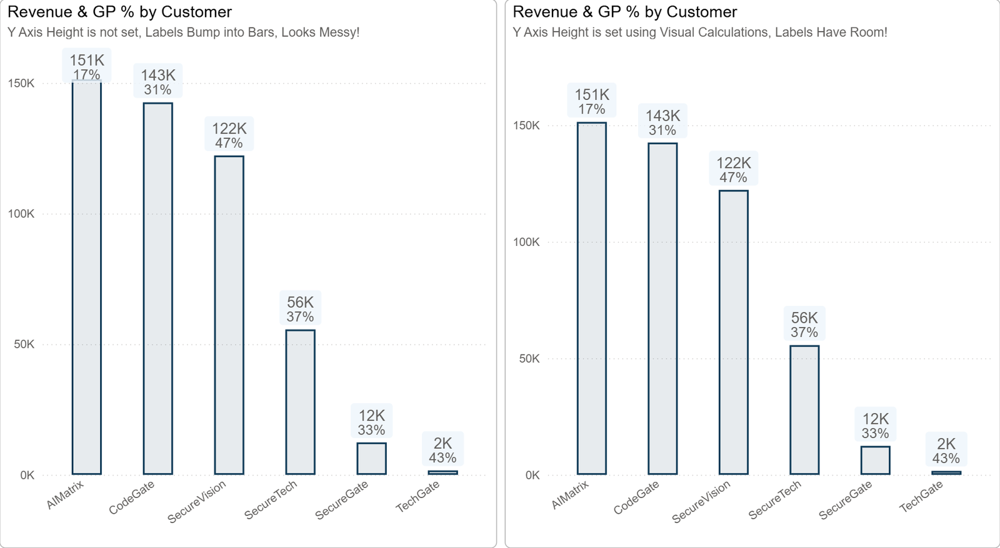

Data labels get clipped when a column reaches the top of the plot area. Put a hidden visual calculation in the Y bucket, bind `valueAxis.end` to it, and the axis always leaves 10 to 20 per cent of headroom no matter what the slicer selection does.

Three variants are in the file, including Gustaw Dudek's `EXPANDALL` version, plus a second page that does the same job from a model measure instead.

One limitation worth knowing before you commit to this: the axis does not re-scale on a drill down. [Error bars](#error-bars-for-column-chart-data-labels) solve that case.

```
Max All =
IF (
    ISINSCOPE ( [Customer] ),
    MAXX ( ALL ( [Customer] ), [Revenue] ) * 1.2,
    EXPAND ( MAX ( [Revenue] ), [Customer] ) * 1.2
)
```

[Read the post](https://www.linkedin.com/feed/update/urn:li:activity:7337303507495989248) &nbsp;·&nbsp; [Download](https://github.com/InsightfulAnalytics/PBI-Files/raw/main/Visual%20Calculations%20for%20Y%20Axis%20Max.pbix) &nbsp;·&nbsp; 3 pages, 15 visuals

<br>

## Chart types the core visuals were never meant to make

### Slope chart

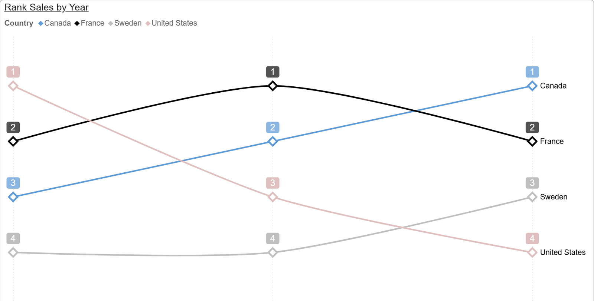

A slope, or bump, chart out of the stock line chart. Plot the rank instead of the measure, keep the measure in the Y bucket but flagged hidden so `RANK` can still see it, then invert and hide the value axis.

```
Rank = RANK ( DENSE, COLUMNS, ORDERBY ( [Revenue], DESC ) )
```

Pages 2 and 3 add field parameters for the dimension and the date grain, with a second visual calculation sizing the axis so it keeps working whatever the parameter returns.

[Read the post](https://www.linkedin.com/feed/update/urn:li:activity:7337734334793007104) &nbsp;·&nbsp; [Download](https://github.com/InsightfulAnalytics/PBI-Files/raw/main/Slope%20Chart.pbix) &nbsp;·&nbsp; 3 pages, 13 visuals

<br>

### Strip plot

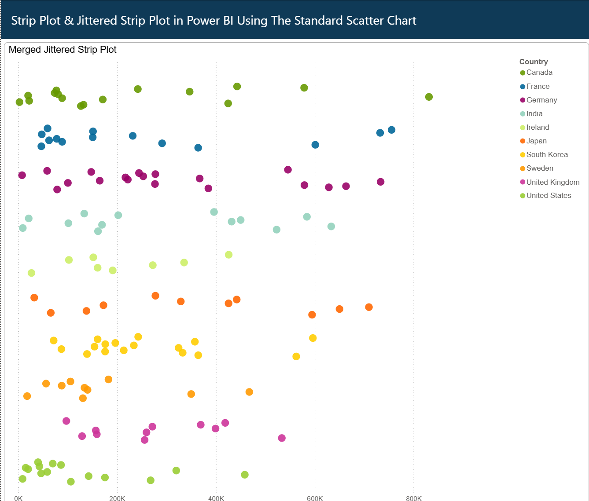

Strip plots and jittered strip plots from the standard scatter chart. A constant valued visual calculation on the Y axis collapses every marker onto one line. Add a second Y field holding a row number and the dots spread back out into a jittered band, which is what stops overlapping points hiding each other.

[Read the post](https://www.linkedin.com/feed/update/urn:li:activity:7351448134960496641) &nbsp;·&nbsp; [And the merged version](https://www.linkedin.com/feed/update/urn:li:activity:7356619256261693441) &nbsp;·&nbsp; [Download](https://github.com/InsightfulAnalytics/PBI-Files/raw/main/Strip%20plot.pbix) &nbsp;·&nbsp; 3 pages, 8 visuals

<br>

### 3 Service Profit Analysis

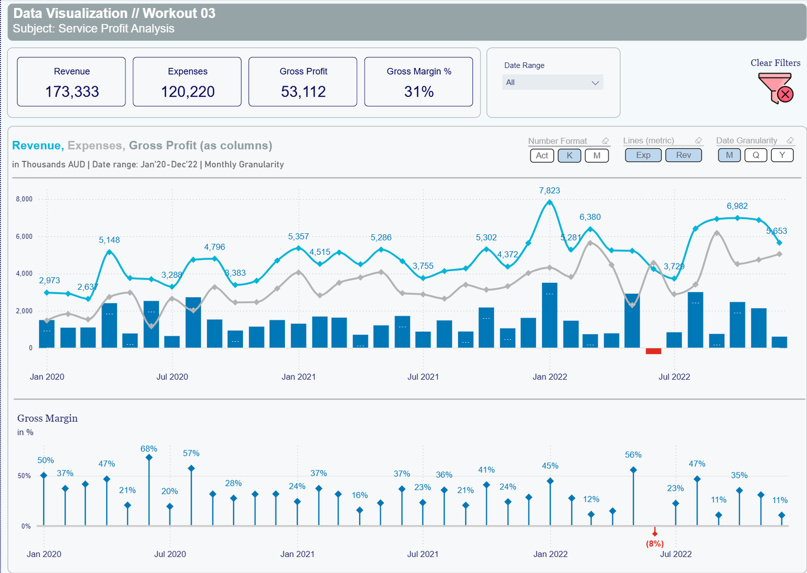

The gross margin panel is a lollipop chart, and there is no lollipop visual involved. Line width is set to 0 so the line vanishes, diamond markers become the heads, and the stems are error bars running from a `[Zero]` measure up to the value. Positive and negative use separate one sided ranges, which is how they end up different colours.

The rest of the report is a field parameter workout: date grain, metric and number format are all swapped from slicers, with the axis maximum pinned to a measure.

[Download](https://github.com/InsightfulAnalytics/PBI-Files/raw/main/3%20Service%20Profit%20Analysis.pbix) &nbsp;·&nbsp; 3 pages, 21 visuals &nbsp;·&nbsp; uses ChicletSlicer

<br>

### Distribution by customer segment

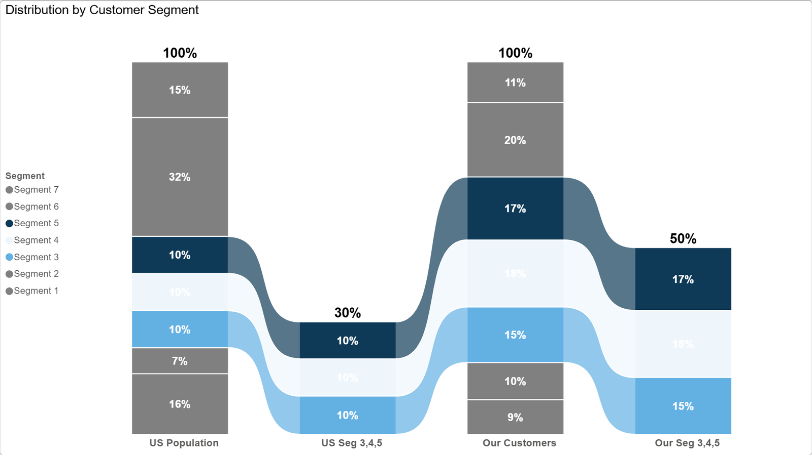

A core visuals rework of a stacked column chart Cole Nussbaumer Knaflic posted. Turning on **ribbon bands** connects the segments across categories, so the eye follows a segment through the population instead of comparing four separate stacks. The takeaway carries: segments 3, 4 and 5 are 30% of the US population and 50% of our customers.

`stackedGapSize` and reversed series order do the rest of the work.

[Read the post](https://www.linkedin.com/feed/update/urn:li:activity:7385990367252242433) &nbsp;·&nbsp; [Download](https://github.com/InsightfulAnalytics/PBI-Files/raw/main/Distribution%20by%20Customer%20Segment%20Stacked%20Columns.pbix) &nbsp;·&nbsp; 1 page, 1 visual

<br>

### Testing ribbon chart

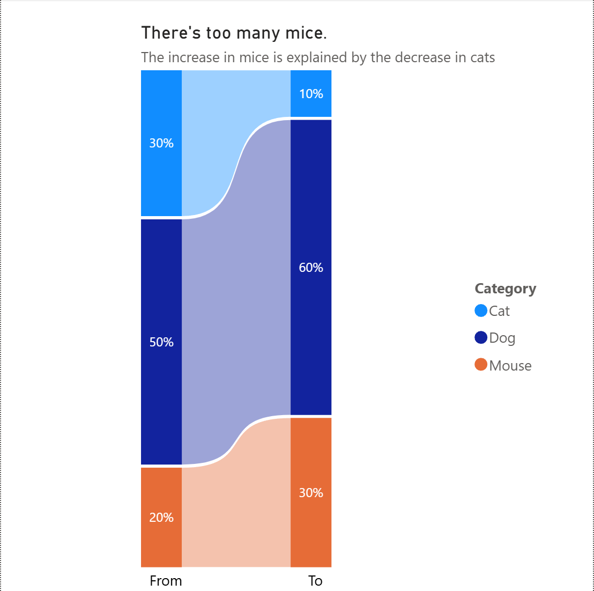

Build a ribbon chart, then change it to a 100% stacked column chart. The `ribbonBands` card survives the conversion even though Power BI never offers it on that visual type, so you keep the connectors and gain share of total.

[Read the post](https://www.linkedin.com/feed/update/urn:li:activity:7318159543660699648) &nbsp;·&nbsp; [Download](https://github.com/InsightfulAnalytics/PBI-Files/raw/main/Testing%20Ribbon%20Chart.pbix) &nbsp;·&nbsp; 1 page, 2 visuals

<br>

## Transparency as a formatting tool

### Transparent chart switching

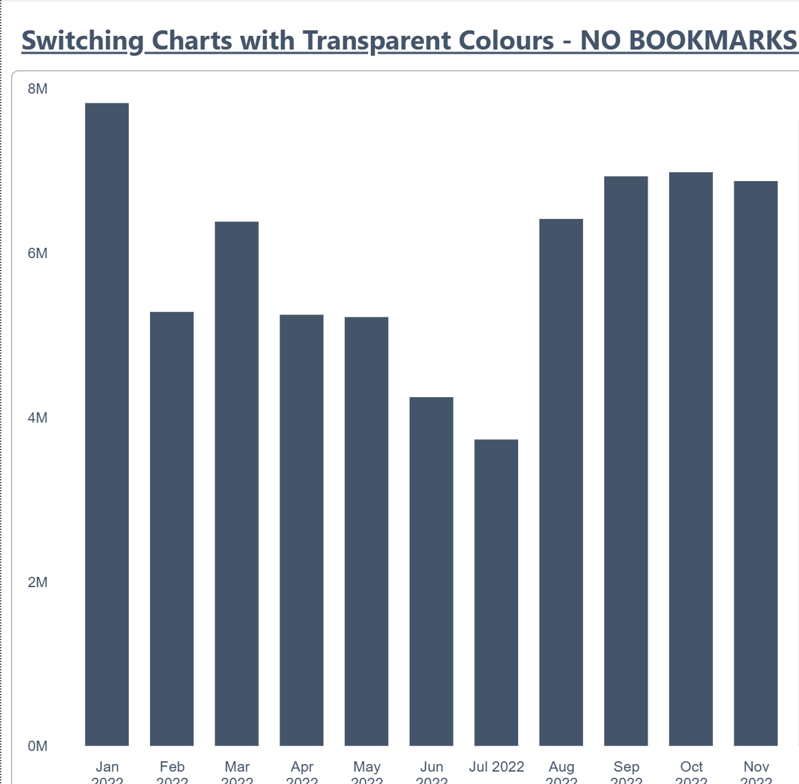

Power BI has no transparent colour. It does have `#FFFFFF00`, which is transparent in hex, except that the colour fields only accept six characters and that is eight. Return it from a measure and conditional formatting takes it happily.

```
Colour Transparent =
IF ( SELECTEDVALUE ( Colour_Switch[Switch] ) = "Chart 1", "#FFFFFF00", "#445469" )
```

Taken to its conclusion: two charts sit on top of each other and both render all the time, a disconnected slicer feeds a colour measure into each one's data point fill and axis label colours, and the chart you did not pick paints nothing at all. Chart switching with no bookmarks.

It is a demo, not a pattern to ship. Tooltips have to be turned off, and only the front chart is selectable, which is why there is an invisible rectangle sitting over both of them.

[Read the post](https://www.linkedin.com/feed/update/urn:li:activity:7336924062843027456) &nbsp;·&nbsp; [Download](https://github.com/InsightfulAnalytics/PBI-Files/raw/main/Transparent%20Chart%20Switching.pbix) &nbsp;·&nbsp; 2 pages, 7 visuals

<br>

### Transparent text

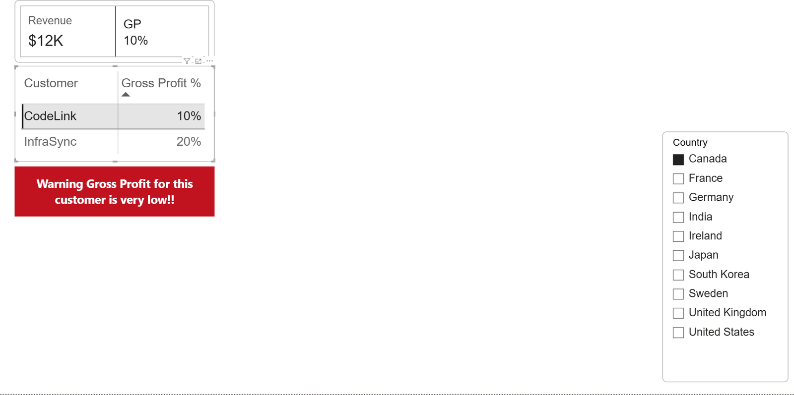

A warning banner that appears when gross profit drops under 15% and is gone otherwise. No bookmark, no button, no extra page.

It all rests on the alpha channel. `#FFFFFF` is the colour, the extra `00` is full transparency, and the colour picker will only accept six digits. A measure can hold all eight:

```
Hex Transparent = FORMAT ( "#FFFFFF00", "0" )
```

The `FORMAT` is not decoration. Conditional formatting only takes a text measure, so without it the measure is unusable. Bind the shape's fill **and** its outline to a measure returning either that or a warning colour, and the banner handles itself.

Anything with a conditional formatting button can be made transparent this way, up to and including a whole visual.

[Read the post](https://www.linkedin.com/feed/update/urn:li:activity:7394621519190028289) &nbsp;·&nbsp; [Download](https://github.com/InsightfulAnalytics/PBI-Files/raw/main/Transparent%20Text.pbix) &nbsp;·&nbsp; 1 page, 4 visuals

<br>

## Variance, highlighting and context

### Variance highlights stacked bar chart

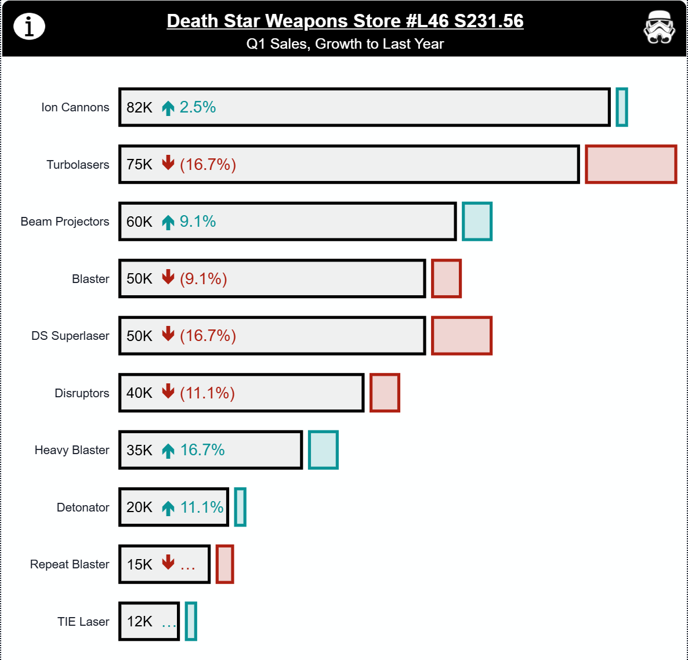

Actual against budget where the **coloured tip of the bar is the variance**. Three measures are stacked: a near invisible base holding the minimum of sales and budget, then two mutually exclusive segments carrying the positive only and negative only absolute variance. Total bar length ends up as the larger of the two figures and the tip is the gap.

The information icon in the corner is its own small trick. Image visuals cannot host a report page tooltip, so it is a card bound to a dummy measure with an image background.

[Read the post](https://www.linkedin.com/feed/update/urn:li:activity:7326008724538429442) &nbsp;·&nbsp; [The info icon post](https://www.linkedin.com/feed/update/urn:li:activity:7333379588082868226) &nbsp;·&nbsp; [Download](https://github.com/InsightfulAnalytics/PBI-Files/raw/main/Variance%20Highlights%20Stacked%20Bar%20Chart.pbix) &nbsp;·&nbsp; 4 pages, 9 visuals

<br>

### 8 line chart with selection highlight

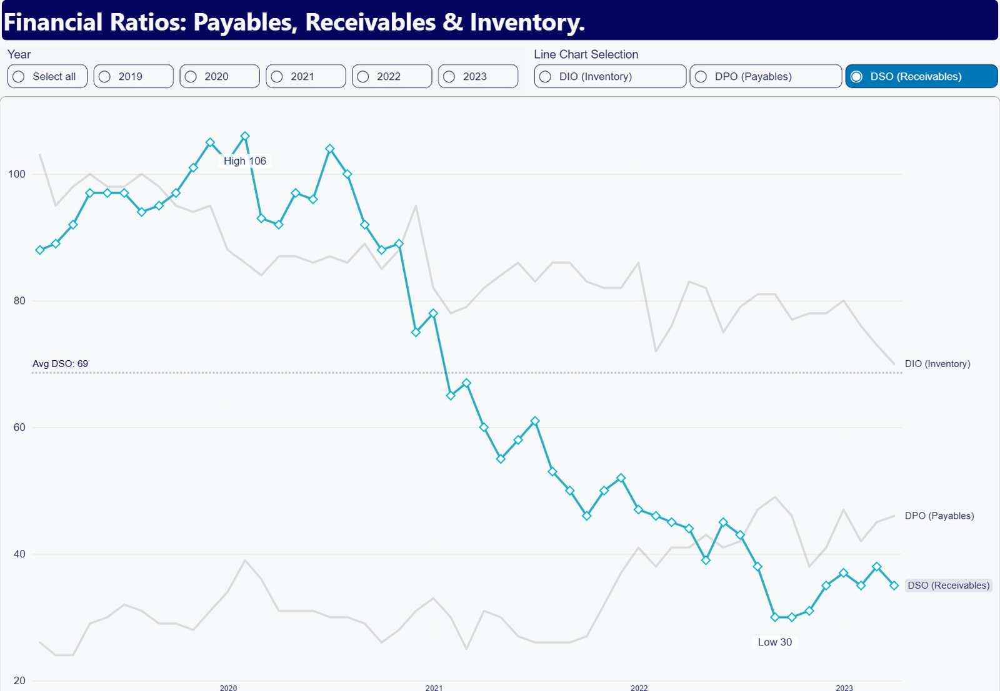

Highlighting one line in a crowded chart, without losing the others for context. A field parameter swaps a duplicate "v2" copy of the selected measure into the first Y slot, so it draws directly over its own greyed out twin. The duplicate is renamed to match, which is why the legend gives nothing away.

[Read the post](https://www.linkedin.com/feed/update/urn:li:activity:7311948014573522944) &nbsp;·&nbsp; [Download](https://github.com/InsightfulAnalytics/PBI-Files/raw/main/8%20Line%20Chart%20With%20Selection%20Highlight.pbix) &nbsp;·&nbsp; 2 pages, 5 visuals

<br>

### Y axis ratio


The scatter chart's ratio line from the Analytics pane, which draws `y = (sum of Y / sum of X) * x` through the origin and gives the plot a reference to read against. The file then reproduces the same ratio in DAX so each bubble can be coloured by whether it sits above or below the line, with a table alongside proving the arithmetic.

Three pages build it up one step at a time.

[Read the article](https://binexus.net/blog/power-bi-scatter-chart-ratio-line/) &nbsp;·&nbsp; [Download](https://github.com/InsightfulAnalytics/PBI-Files/raw/main/Y%20Axis%20Ratio.pbix) &nbsp;·&nbsp; 3 pages, 7 visuals

<br>

### Health dataset

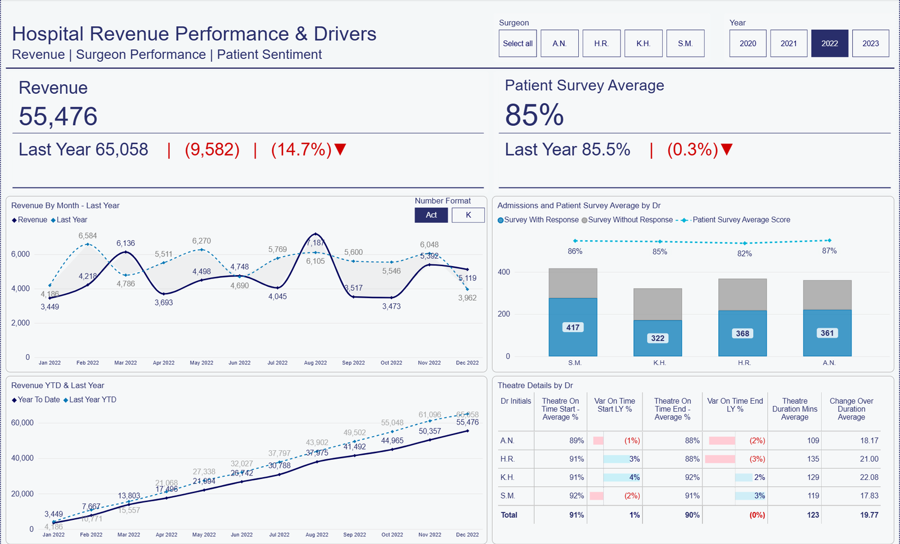

A hospital performance report that doubles as a conditional formatting showcase. The standout is the shaded band between actual and last year, which Power BI has no feature for: turn error bars on for the Last Year series only, switch the bar off and the shade on, then bind the lower bound to the
**other** series' measure.

Also in here: custom tooltips, KPI cards built from measure bound reference labels, and a deliberately unformatted control card so you can see what the dynamic format strings are doing.

[The report reveal](https://www.linkedin.com/feed/update/urn:li:activity:7240321843184689152) &nbsp;·&nbsp; [Custom tooltips post](https://www.linkedin.com/feed/update/urn:li:activity:7327586351061577728) &nbsp;·&nbsp; [Axis headroom in DAX](https://www.linkedin.com/feed/update/urn:li:activity:7245649268789690368) &nbsp;·&nbsp; [Download](https://github.com/InsightfulAnalytics/PBI-Files/raw/main/Health%20Dataset.pbix) &nbsp;·&nbsp; 4 pages, 14 visuals

<br>

## Matrix layout and DAX plumbing

### Half blank lines P&L

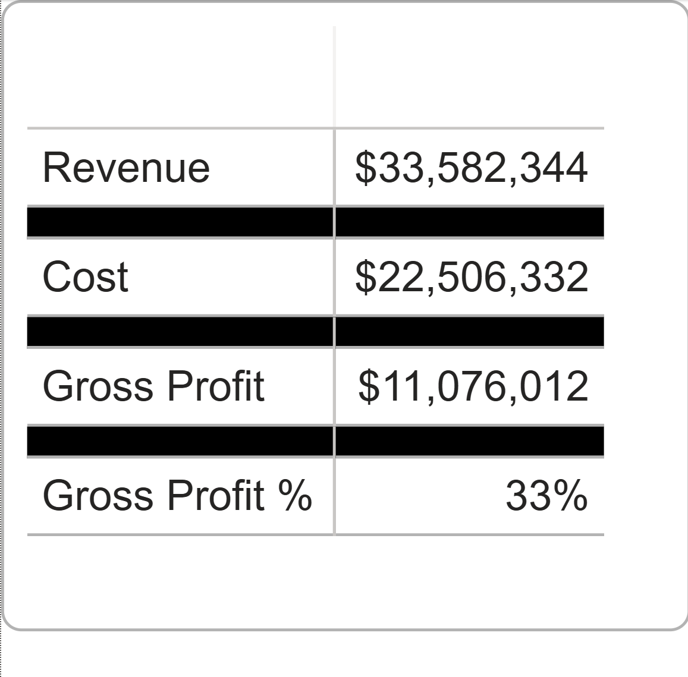

"But I can make it in Excel." A P&L in a matrix with **no Rows field and no Columns field** at all. The measures run down the left through Values on row, and a dummy measure whose dynamic format string is a single space in quotes gets dropped into Values between the real line items.

Power BI then renders those rows at **half height**, which is the part nobody can explain. Add row padding and an alternating row background and they become the separator bands in the picture. Found by accident, and almost certainly a bug.

[Read the post](https://www.linkedin.com/feed/update/urn:li:activity:7371080971565060096) &nbsp;·&nbsp; [Download](https://github.com/InsightfulAnalytics/PBI-Files/raw/main/Half%20Blank%20Lines%20P%26L.pbix) &nbsp;·&nbsp; 2 pages, 1 visual

<br>

### Sales & budget

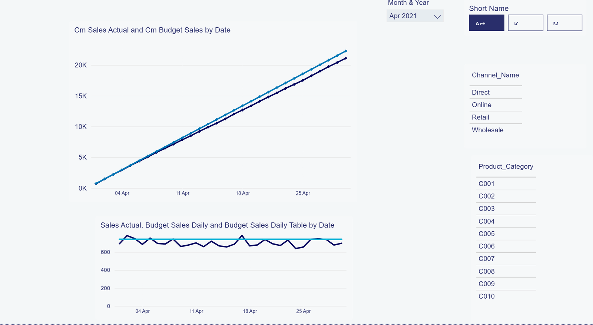

Turning a monthly budget into a daily one in DAX, then comparing it to actuals as a cumulative month to date line. The interesting page is the benchmark: three tables built as a hand rolled Performance Analyzer harness, racing the measure that allocates on the fly against one that reads from a pre-materialised daily table.

The follow up post makes the case for doing the transformation upstream instead, which is usually the right answer.

[Read the post](https://www.linkedin.com/feed/update/urn:li:activity:7248319287663206404) &nbsp;·&nbsp; [The follow up](https://www.linkedin.com/feed/update/urn:li:activity:7248557346174447616) &nbsp;·&nbsp; [Download](https://github.com/InsightfulAnalytics/PBI-Files/raw/main/Sales%20%26%20Budget.pbix) &nbsp;·&nbsp; 4 pages, 13 visuals

<br>

## Full index

| File | What it shows | Pages | Visuals | Post |
|---|---|:--:|:--:|:--:|
| [3 Service Profit Analysis](3%20Service%20Profit%20Analysis.pbix) | Lollipop chart from a zero width line plus error bar stems | 3 | 21 | none |
| [8 Line Chart With Selection Highlight](8%20Line%20Chart%20With%20Selection%20Highlight.pbix) | Field parameter swaps a duplicate measure over its dimmed twin | 2 | 5 | [2025-03-30](https://www.linkedin.com/feed/update/urn:li:activity:7311948014573522944) |
| [Data Labels Above X Axis](Data%20Labels%20Above%20X%20Axis.pbix) | Negative visual calcs park every label above the axis | 1 | 3 | [2025-10-09](https://www.linkedin.com/feed/update/urn:li:activity:7381908321672318976) |
| [Distribution by Customer Segment Stacked Columns](Distribution%20by%20Customer%20Segment%20Stacked%20Columns.pbix) | Ribbon bands on a stacked column chart | 1 | 1 | [2025-10-20](https://www.linkedin.com/feed/update/urn:li:activity:7385990367252242433) |
| [Dynamic format strings](Dynamic%20format%20strings.pbix) | Keeping a dynamic format string alive in a parked data label | 2 | 4 | [2025-11-04](https://www.linkedin.com/feed/update/urn:li:activity:7391370848294719488) |
| [Error bars for column chart data labels](Error%20bars%20for%20column%20chart%20data%20labels.pbix) | Invisible error bar reserves headroom for two line labels | 1 | 4 | [2025-11-14](https://www.linkedin.com/feed/update/urn:li:activity:7394984274246000642) |
| [Half Blank Lines P&L](Half%20Blank%20Lines%20P%26L.pbix) | Space format string renders half height separator rows | 2 | 1 | [2025-09-09](https://www.linkedin.com/feed/update/urn:li:activity:7371080971565060096) |
| [Health Dataset](Health%20Dataset.pbix) | Error bar shading fakes an actual versus last year band | 4 | 14 | [2024-09-13](https://www.linkedin.com/feed/update/urn:li:activity:7240321843184689152) |
| [Sales & Budget](Sales%20%26%20Budget.pbix) | Monthly budget allocated to daily grain, with a speed test | 4 | 13 | [2024-10-05](https://www.linkedin.com/feed/update/urn:li:activity:7248319287663206404) |
| [Slope Chart](Slope%20Chart.pbix) | RANK visual calculation on an inverted line chart | 3 | 13 | [2025-06-09](https://www.linkedin.com/feed/update/urn:li:activity:7337734334793007104) |
| [Strip plot](Strip%20plot.pbix) | Constant visual calc collapses a scatter chart into a strip | 3 | 8 | [2025-07-17](https://www.linkedin.com/feed/update/urn:li:activity:7351448134960496641) |
| [Testing Ribbon Chart](Testing%20Ribbon%20Chart.pbix) | Ribbon bands kept on a 100% stacked column chart | 1 | 2 | [2025-04-16](https://www.linkedin.com/feed/update/urn:li:activity:7318159543660699648) |
| [Transparent Chart Switching](Transparent%20Chart%20Switching.pbix) | Transparent colour measures switch charts without bookmarks | 2 | 7 | [2025-06-07](https://www.linkedin.com/feed/update/urn:li:activity:7336924062843027456) |
| [Transparent Text](Transparent%20Text.pbix) | Measure driven fill hides and shows a warning banner | 1 | 4 | [2025-11-13](https://www.linkedin.com/feed/update/urn:li:activity:7394621519190028289) |
| [Variance Highlights Stacked Bar Chart](Variance%20Highlights%20Stacked%20Bar%20Chart.pbix) | Three segment stack turns the bar tip into the variance | 4 | 9 | [2025-05-08](https://www.linkedin.com/feed/update/urn:li:activity:7326008724538429442) |
| [Visual Calculations for Y Axis Max](Visual%20Calculations%20for%20Y%20Axis%20Max.pbix) | Hidden visual calculation drives the value axis maximum | 3 | 15 | [2025-06-08](https://www.linkedin.com/feed/update/urn:li:activity:7337303507495989248) |
| [Y Axis Ratio](Y%20Axis%20Ratio.pbix) | Scatter ratio line plus DAX that colours each bubble | 3 | 7 | [2025-05-30](https://binexus.net/blog/power-bi-scatter-chart-ratio-line/) |

<br>

## Notes

**Format.** Fifteen of these are classic `.pbix` files. Two, *Error bars for column chart data labels* and *Transparent Text*, were saved from a newer Desktop build and carry the enhanced report format inside, so their report definitions are readable JSON if you unzip them.

**Themes.** Most files use a theme built with the BIBB.PRO theme generator, or one of my "2025 Projects" palettes. *Testing Ribbon Chart* is the one that runs on the stock Power BI theme.

**Data.** All sample data. Nothing here comes from a client.

<br>

## Licence

Released under the [MIT Licence](LICENSE). Use the files, take the techniques apart, reuse them in your own work.

<br>

## About

I am Tim Osborn, a Power BI and Fabric consultant in Sydney. I post a Power BI tip most weeks, and when the tip needs a file to make sense, the file ends up here.

[**Follow me on LinkedIn**](https://www.linkedin.com/in/osborntim/) for the posts these files come from.

<div align="center">
<br>
If any of this was useful, a ⭐ helps other people find it.
</div>
